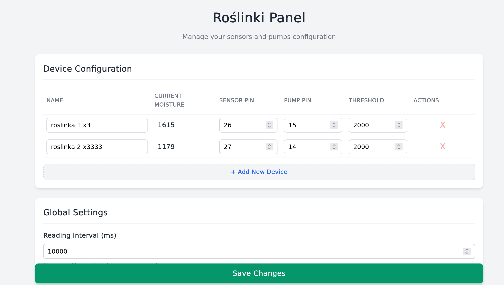

# Roślinki - Automatic Plant Watering System

This project currently supports independent watering for up to 3 plants, with plans to expand capacity in the future.

The system assumes a distributed setup where each plant acts as a node with its own moisture sensor and water pump.

## Web panel


*(Screenshot of the web control panel)*

---

## Hardware

This project is designed to be budget-friendly (< $11.00 total)

| Component | Est. Price (PLN) | Est. Price (USD) | Notes |
| :--- | :--- | :--- | :--- |
| **Raspberry Pi Pico 2W** | ~35 zł | ~$9.00 | Main Controller |
| **Water Pump** | 4 zł | ~$1.00 | Per plant (5V submersible) |
| **Moisture Sensor** | 5 zł | ~$1.25 | Per plant (Capacitive recommended) |
| **USB Power Supply** | - | - | Standard phone charger |
| **Total** | **< 45 zł** | **< $11.00** | |

## Roadmap

- [x] Basic watering logic for up to 3 plants
- [x] Web Control Panel (Dockerized)
- [x] Flashing support
- [ ] Support for external ADC modules for >3 plants
- [ ] Add historical data charts in the panel
- [ ] Implement user authentication

---

## Installation

### 1. Secrets Configuration
Create a `secrets.h` file in the root directory of the firmware project. This file handles your WiFi and MQTT credentials.

```cpp
#ifndef SECRETS_H
#define SECRETS_H

#define SECRET_WIFI_SSID "MY_SSID"
#define SECRET_WIFI_PASS "MY_PASS"

#define SECRET_MQTT_HOST "192.168.X.X"
#define SECRET_MQTT_PORT 1883
#define SECRET_MQTT_USER "user"
#define SECRET_MQTT_PASS "password"

#endif```

### 2. Backend

**Build the image:**
```bash
cd backend
docker build -t roslinki:prod .```

Deploy: You can deploy this on a Raspberry Pi, HomeLab, or VPS.

A docker-compose.yml example is included in the backend folder.

It is pre-configured for Traefik (auto-subdomain hosting) and includes a Mosquitto broker.

### 3. Flashing the Pico

Use the included Makefile to build and upload the firmware.
Build release:
```bash
make release```

Upload the generated .uf2 file to the RPi Pico manually.

Upload via Debug Probe:

```bash
make upload-release```

### 4. Wiring

#### Moisture Sensors
- Connect to ADC Pins (GP26, GP27, GP28).
#### Water Pumps
- Powered from 5V
- Controlled via GPIO + transistor / motor driver
